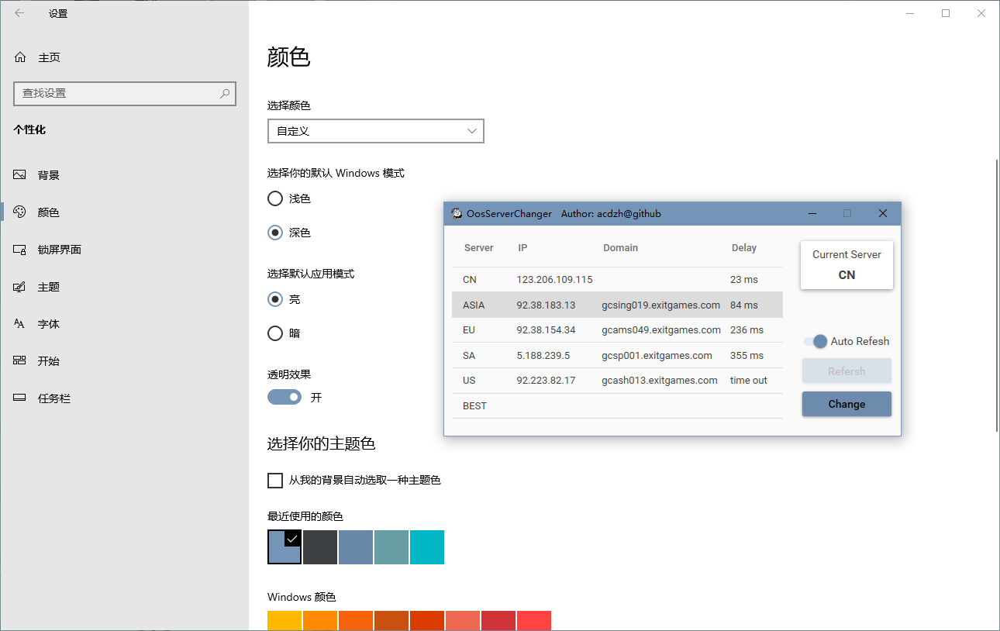
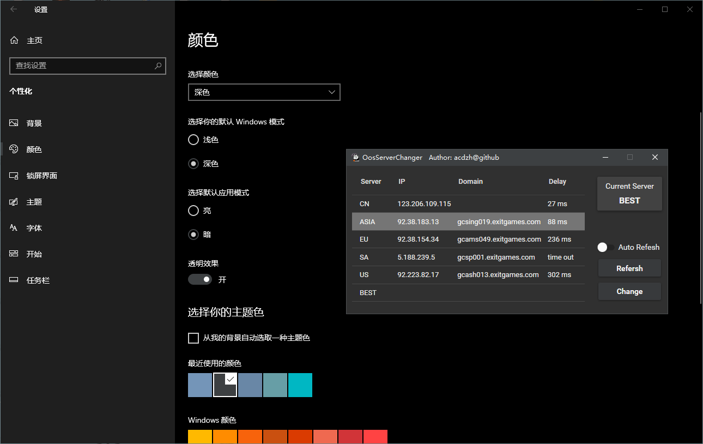

# OosServerChanger

[Out of Space](https://store.steampowered.com/app/400080/Out_of_Space/) is an interesting game released by [Behold Studio](https://store.steampowered.com/publisher/beholdstudios). It has five servers around the world. This app is a tool to find which is the fast server and quickly change the server.

## Screenshots

It can automaticly use current Windows Theme, include the *Light* or *Dark* Mode, and the accent color now.

## How to Use

## download

You can download the release version on the [release page](https://github.com/acdzh/OosServerChanger/releases).

### change server

Just select the server item, and click the button `Change`.

### test delay

This game have five server:

|Name|Domain|IP|Provider|Address|
|:----:|:----:|:----:|:----:|:----:|
|CN|Nil|123.206.109.115|Tencent cloud computing (Beijing) Co., Ltd.,|Shanghai, China|
|ASIA|gcsing019.exitgames.com|92.38.183.13|G-Core Labs S.A|Singapore|
|EU|gcams049.exitgames.com|92.38.154.34|Core-Backbone GmbH.|Amsterdam, Netherlands|
|SA|gcsp001.exitgames.com|5.188.239.5|G-Core Labs S.A|Sao Paulo, Brazil|
|US|gcash013.exitgames.com|92.223.82.17|G-Core Labs S.A|Ashburn, Virginia, USA|
|BEST|||||

Best: Automaticly find a fast server form all servers exclude CN.

Clicking the button `Refesh` can test all the delay once.

Switch on the switch `auto refesh` can test all the delay again and again with the interval 1 second.

The time out limit is 2000ms.

You can see it in the class `Utils`.

### Others

thanks to [MaterialDesignInXAML](https://github.com/MaterialDesignInXAML/MaterialDesignInXamlToolkit).
